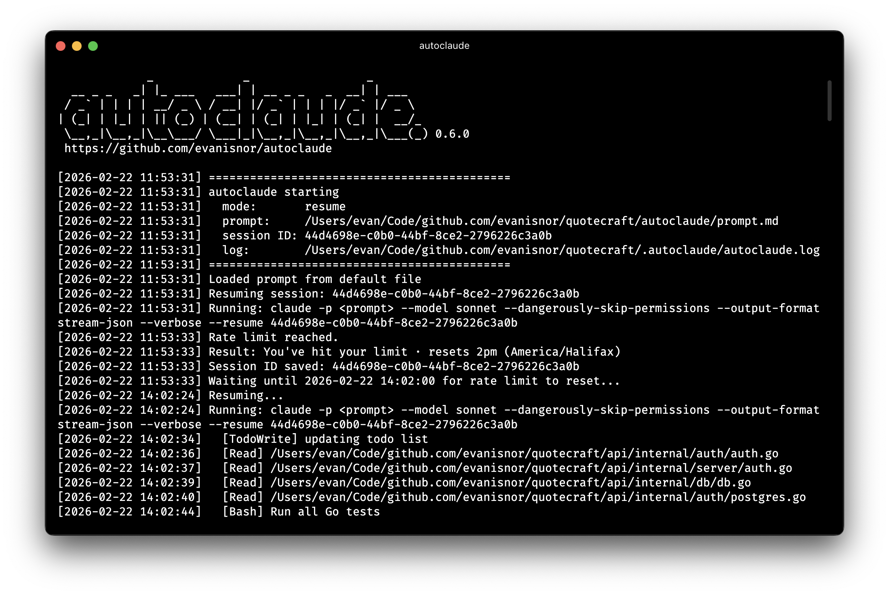

# autoclaude

Automated Claude Code runner designed for use with Claude Code subscription plans where usage limits are frequently hit. Runs `claude` in non-interactive mode until your rate limit window is hit, and then automatically resumes when the window re-opens so you can walk away and let it work.

Things you can do while `autoclaude` works:
* Eat
* Sleep
* Reflect on the meaning of life and the mysteries of the universe
<br />
<br />

> ⚠️ **Security advisory:** This tool runs Claude with all permission prompts disabled. Claude can read and write files, run shell commands, and make network requests without confirmation. Read the [Security Considerations](#security-considerations) section before use.



## Getting Started

```bash
brew install evanisnor/tap/autoclaude
```

Create a prompt file at `autoclaude/prompt.md` in your project, then run:

```bash
autoclaude
```

Sessions are saved and resumed automatically — if `autoclaude` is restarted, it picks up where it left off.

## How It Works

`autoclaude` launches `claude` in non-interactive mode with `--dangerously-skip-permissions` (yolo mode), streams its JSON output, and monitors for rate limit events. When a usage limit is hit, it reads the reset timestamp from the event stream, sleeps until 2 minutes after the reset, then resumes the same session automatically. This repeats until Claude exits cleanly.

To maintain optimal context window performance it is recommended to let autoclaude manage claude sessions automatically. This requires installing a hook to your project by executing claude once with the `--install-hook` flag. Read more about how this works in the [Context Management for Long-Running Projects](#context-management-for-long-running-projects) section.


## Usage

```bash
autoclaude                                    # Resume saved session, or start new
                                              # Uses `autoclaude/prompt.md` as the prompt

autoclaude --install-hook                     # Install the `new-session-on-todos-complete` hook
autoclaude --new                              # Force a new session (discards saved session ID)
autoclaude -p "Build the login page"          # Use a text prompt
autoclaude --prompt-file my-prompt.md         # Use a specific prompt file
autoclaude --path-to-claude /path/to/claude   # Override the claude binary location
autoclaude --model opus                       # Override the model
```

### Flags

| Flag | Description |
|------|-------------|
| *(none)* | Resume the saved session if one exists, otherwise start fresh |
| `--new` | Force a new session, discarding any saved session ID |
| `-p`, `--prompt <text>` | Use the given text as the prompt |
| `--prompt-file <file>` | Load the prompt from a file instead of the default location |
| `--install-hook` | Install the `new-session-on-todos-complete` hook into the current project |
| `--path-to-claude <path>` | Override the path to the `claude` binary (default: `claude` on `PATH`) |
| `--model <model>` | Override the model (default: `sonnet`) |
| `--debug` | Enable debug logging (written to stdout and `autoclaude.log`) |
| `--utc` | Print log timestamps in UTC instead of local time with offset |
| `--usage` | Print help text and exit |

## Requirements

- [Claude Code](https://docs.anthropic.com/en/docs/claude-code) installed and available on your `PATH` (or pass `--path-to-claude` to specify a location)
- `jq`
- `bash` 4+

## Configuration

### Prompt file

By default, `autoclaude` looks for a prompt in:

1. `autoclaude/prompt.md`
2. `autoclaude/prompt.txt`

Create one of these files with the task you want Claude to work on. You can override the path at runtime with `--prompt-file` or provide an inline text prompt with `-p`.

### Environment variables

| Variable | Default | Description |
|----------|---------|-------------|
| `CLAUDE_BIN` | `claude` | Path to the `claude` binary. Overridden by `--path-to-claude` at runtime. |

Any model identifier accepted by the `claude` CLI can be used.

## The `.autoclaude` directory

`autoclaude` creates a `.autoclaude/` directory in the project root to store runtime state and logs. **Add it to your `.gitignore`.**

| File | Description |
|------|-------------|
| `autoclaude.log` | Timestamped log of all runs, tool calls, rate limit events, and session activity |
| `session_id` | The session ID from the most recent completed run, used for automatic resume |
| `last_session.json` | Raw stream-json event lines from the last Claude invocation |
| `run_state` | Transient file written during a run to pass session ID and reset timestamps out of the stream processor subshell |
| `new_session_requested` | Signal file written by the `new-session-on-task-complete` hook when all of Claude's todos are complete. This tells autoclaude to start a new session with fresh context automatically. |
| `skip_gitignore_check` | Signal file written when you choose "don't ask again" at the `.gitignore` prompt. Delete this file to re-enable the check. |

## Context Management for Long-Running Projects

Over a long session, Claude's context window fills with tool call history, intermediate results, and prior work — degrading performance on tasks that require careful recall. Running each project task in its own fresh session prevents this.

autoclaude supports automatic session rotation via a Claude hook. When all of Claude's todos are completed, the hook signals autoclaude to start a new session instead of resuming, so each project task begins with a full context window.

Install the hook by running the following command:

```bash
autoclaude --install-hook
```

### How it works

Claude uses a built-in todo list (via `TodoWrite`) to track its own progress within a session. This is separate from your project's task backlog. After each `TodoWrite` call, the installed hook checks whether any todos remain incomplete. When all are done, it writes `.autoclaude/new_session_requested` and injects an exit prompt into Claude's next turn. On clean exit, autoclaude detects the signal, discards the session ID, and loops back — starting fresh with the same prompt.

## Security Considerations

`autoclaude` passes `--dangerously-skip-permissions` to Claude on every run. This disables all permission prompts, meaning Claude will read files, write files, execute arbitrary shell commands, and make network requests without asking. It also disables trust verification for new codebases and MCP servers (a side effect of running with `-p` in non-interactive mode).

**Do not run this against a codebase or on a machine where unreviewed, autonomous actions could cause damage.**

### Risks

- **Destructive commands** — Claude can run any shell command, including `rm`, `git reset --hard`, database migrations, deployments, etc.
- **Credential exposure** — Without restrictions, Claude can read `.env` files, AWS credential files, SSH keys, and anything else on disk.
- **Network access** — Claude can make arbitrary web requests (`curl`, `wget`, `WebFetch`) which could exfiltrate data or download and execute remote content.
- **Prompt injection** — If Claude reads files containing adversarial instructions (e.g., from fetched web content or untrusted dependencies), those instructions execute without a human in the loop.

### Recommended `.claude/settings.json`

Lock down what Claude can touch by adding a project-level settings file. Three example configs are included at increasing levels of strictness — copy the one that fits your situation to `.claude/settings.json`:

| File | What it does |
|------|-------------|
| [claude-settings.json.minimal](claude-settings.json.minimal) | Denies access to credential files only. Claude can still run arbitrary shell commands and make network requests. |
| [claude-settings.json.standard](claude-settings.json.standard) | Denies credential file access and blocks outbound network tools (`curl`, `wget`, `WebFetch`, `WebSearch`). |
| [claude-settings.json.strict](claude-settings.json.strict) | Enables bash sandboxing with an explicit network domain allowlist. The most isolated option. |

If you want to prevent `--dangerously-skip-permissions` from being used at all in a shared or managed environment, set this in your managed settings:

```json
{
  "permissions": {
    "disableBypassPermissionsMode": "disable"
  }
}
```

Note that setting `disableBypassPermissionsMode` will break `autoclaude` entirely — it is intended for environments where you want to prevent autonomous runs altogether.

---

This project is not affiliated with, endorsed by, or sponsored by Anthropic. Claude and Claude Code are trademarks of Anthropic, PBC.
